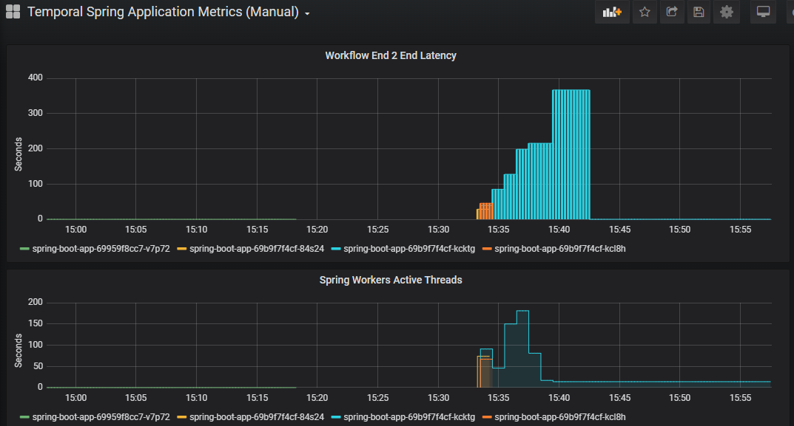
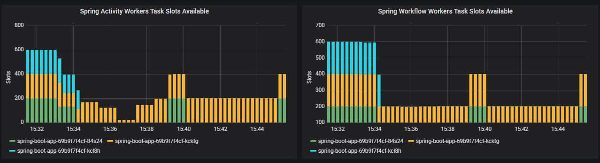
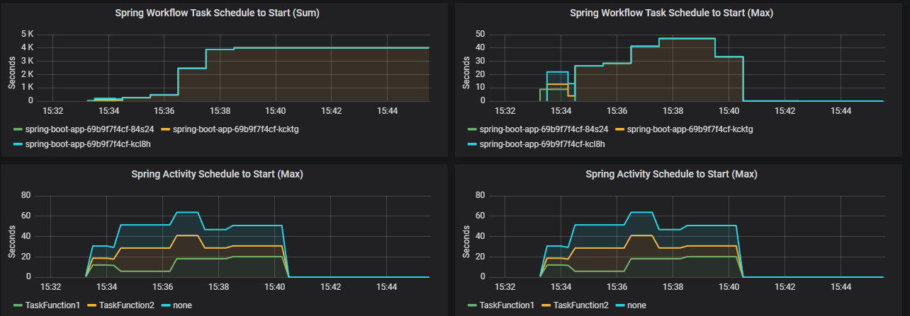
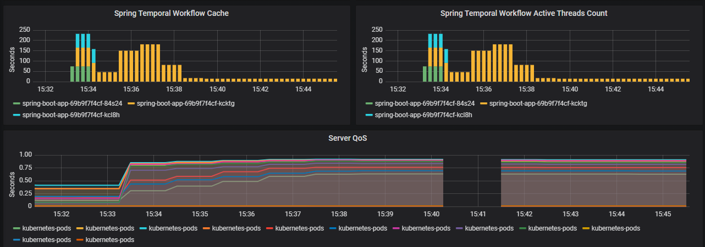

## Running Temporal Clusters on Minikube
 Evaluating a Setup for Temporal Kubernetes running on Minikube. 

## Version Upgrade 1.21.5 Work in Progress
 - Added CertManager and SelfSigned CA and Individual Certificates
 - elastic-search setup for HTTPS & Secret
 - TODO Job temporal-es-index-setup currently setup for --insecure curl needs to be changed to use CA Trusted. --cacert /etc/config/ca-keystore/ca.crt
 - 


### Temporal Features & Setup being Evaluated.  
 - Archival Features with FileStore
 - Advanced visibility with ES & CustomSearch Attributes.
 - Monitoring with Grafana+Prometheus  
 - Multi Cluster Replication.
 - Go Smoke Test Application with Docker Builds.

### Modules
 - [minikube-deploy](minikube-deploy/) Helm Charts & Setup Instructions for Components
 - [spring-boot-app](spring-boot-app/README.md) with micrometer & prometheus and Helm Charts for deployment.
 - [smoke-test-go-app](smoke-test-go-app) Go Application to Smoke Test Temporal Workflow.

### Observability With Grafana :

#### Resources:
 - Recommended Metrics (https://docs.temporal.io/application-development/worker-performance)

####
Prometheus Evaluate Metrics :
[prometheus](http://192.168.1.205:18080/graph?g0.expr=&g0.tab=1&g0.stacked=0&g0.show_exemplars=0&g0.range_input=1h)
- Get all Metrics Names ```group by(__name__) ({__name__!=""})```
### Spring Application Metrics. (Filter by {job="prometheus-spring-pods"})
Graana Metrics Used, used prometheus to analyse e.g. ```temporal_worker_task_slots_available{job="prometheus-spring-pods"}```
```
sum by(hostname) (temporal_worker_task_slots_available{job="prometheus-spring-pods"})
sum by(hostname) (temporal_workflow_task_schedule_to_start_latency_seconds_max{worker_type="WorkflowWorker",job="prometheus-spring-pods"})
sum by(hostname) (temporal_workflow_task_schedule_to_start_latency_seconds_sum{worker_type="WorkflowWorker",job="prometheus-spring-pods"})
sum by(activity_type) (temporal_activity_schedule_to_start_latency_seconds_max{job="prometheus-spring-pods"})
sum by(activity_type) (temporal_activity_schedule_to_start_latency_seconds_sum{job="prometheus-spring-pods"})
sum by(hostname) (temporal_sticky_cache_size{job="prometheus-spring-pods"})
sum by(hostname) (temporal_workflow_active_thread_count{job="prometheus-spring-pods"})
```






#### Section Under development.

History Service Dashboards > Workflow Task Insight | Workflow Task Breakdown
 - schedule_activity count 
 - Prometheus Query ```schedule_activity_command {operation="RespondWorkflowTaskCompleted"}```
 - , complete_workflow count.
 
 Spring Application Worker, Metrics added.  
 - Seconds ```sum by(hostname)(temporal_workflow_endtoend_latency_seconds_max{job="prometheus-spring-pods"})```
 - Counter ```temporal_workflow_completed_total{job="prometheus-spring-pods"}```
 - ```temporal_workflow_active_thread_count{job="prometheus-spring-pods"}```
 - Guage ```temporal_activity_schedule_to_start_latency_seconds_max{profile="kbe"}```

 ### Synthetics Tests with Benchmark Worker 
 #### 4 July 2024 Comparing Postgres vs Cassandra on MiniKube

```shell
08:53 - 09:47 : Postgres (Run 1) , 512 Shard , benchmark-worker 5, soak-test 1 (CONCURRENT_WORKFLOWS=10000), Workflows Created 100,000 
09:50 - 10:40 : Postgres (Run 2) , 512 Shard , benchmark-worker 10, soak-test 1 (CONCURRENT_WORKFLOWS=10000), Workflows Created 100,000 

11:45 - 13:38 : Cassandra (Run 1) - Discarded System Crash , 512 Shard , benchmark-worker 10, soak-test 1 (CONCURRENT_WORKFLOWS=10000), Workflows Created 100,000 

13:42 - 14:19 : Cassandra (Run 2) , 512 Shard , benchmark-worker 10, soak-test 1 (CONCURRENT_WORKFLOWS=10000), Workflows Created 100,000 
```

https://snapshots.raintank.io/dashboard/snapshot/E96QvATu82P2Heim7IlPQOIQuagBIyNw 
https://snapshots.raintank.io/dashboard/snapshot/JDIBs9hJT7hIcSNCW4AL3af54UPaL3PF 
https://snapshots.raintank.io/dashboard/snapshot/cgiK5gEphrwf979xV87hmn53MsxLSIEn 
https://snapshots.raintank.io/dashboard/snapshot/MD3eONuXof0NG73LfJhFiyarPy7NomWb 